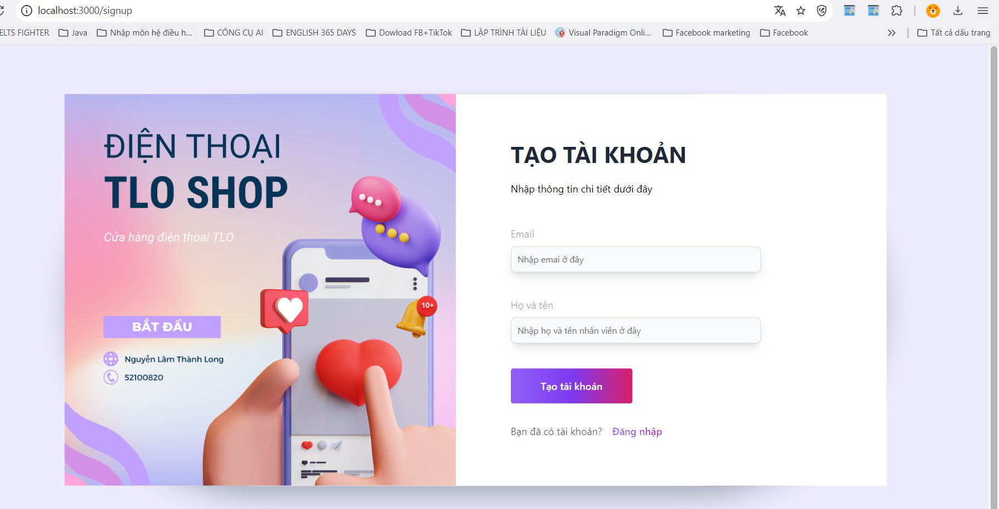
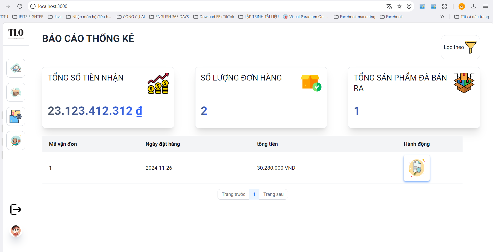
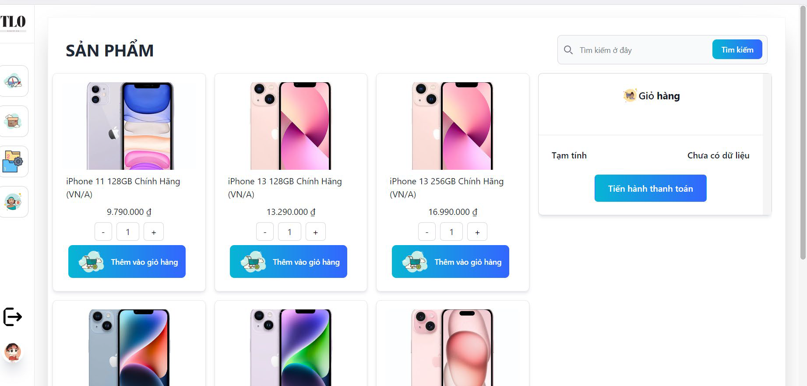
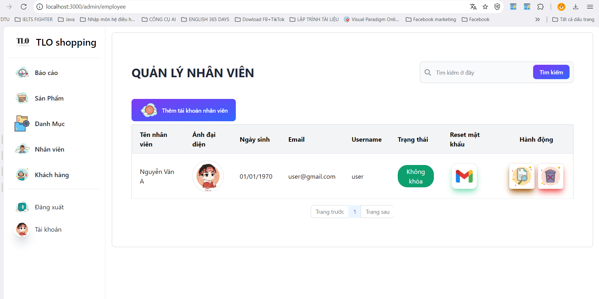
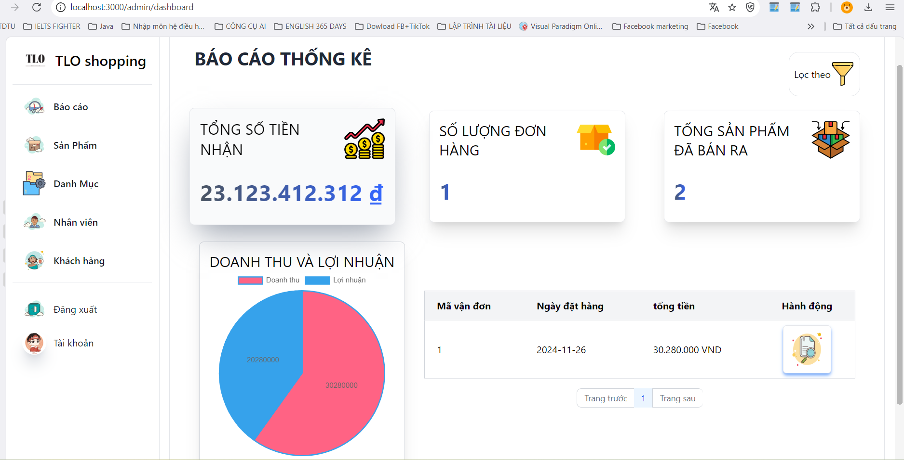

# 📱 TLO Phone Store  
📌 *[Xem bản tiếng Việt](README_vn.md)*
## 🌟 Introduction  
TLO Phone Store is an e-commerce platform specializing in mobile phone sales. The system is built with a modern architecture, ensuring high performance, security, and scalability.  

## 🛠️ Technologies Used  

### 🔹 Frontend  
- **ReactJS + Vite**: High performance, optimized page loading speed.  
- **Tailwind CSS**: Fast and flexible UI design.  
- **Ant Design (AntD)**: Provides professional UI components.  
- **Flowbite**: Supports flexible UI/UX.  
- **Chart.js**: Displays statistical reports visually.  

### 🔹 Backend  
- **NestJS**: Modular architecture for flexible API development.  
- **Argon2**: Secure password hashing.  
- **Passport.js**: Authentication and session management.  
- **Swagger**: Provides detailed API documentation.  

### 🔹 Database & Infrastructure  
- **MySQL**: Robust relational database management.  
- **Nginx**: Load balancing to optimize performance.  
- **Docker**: Containerizing backend & frontend for easy deployment.  

---  

## ✨ Features  

### 🏬 **For Employees**  
✅ Create invoices.  
✅ View product list.  
✅ View category list.  
✅ Manage customers.  
✅ Manage employee accounts.  
✅ Login, logout, password recovery (via Gmail).  
✅ Statistical reports: Total revenue, number of orders, total products sold, and order list.  

### 👑 **For Admins**  
✅ Manage products.  
✅ Manage categories.  
✅ Manage employees.  
✅ Manage customers.  
✅ Change password.  
✅ Login, logout, create employee accounts.  
✅ Statistical reports: Revenue, profit, total income, number of orders, total products sold, and order list.  

---  

## 🚀 Deployment Guide  

### 🔧 Requirements  
- **ReactJS & NestJS** (for frontend and backend).  
- **Docker & Docker Compose** (for deployment).  
- **MySQL** (database setup).  

### 📦 Running the Application with Docker  

#### 1️⃣ Pull MySQL and Start MySQL  
Run the following command:  
```bash  
docker-compose up -d db  
```  

#### 2️⃣ Build the Services from Dockerfile  
Run the following command:  
```bash  
docker-compose build  
```  

#### 3️⃣ Start the Entire Project with Docker Compose  
Run the following command:  
```bash  
docker-compose up -d  
```  

#### 4️⃣ Check Running Docker Containers  
Run the following command:  
```bash  
docker ps  
```  

### 🔑 Default Login Credentials  

#### **Admin Account**  
- **Username:** `admin`  
- **Password:** `12345678`  

#### **Employee Account**  
- **Username:** `user`  
- **Password:** `12345678`  

#### 5️⃣ Access the Application  
```bash  
http://localhost:3000/login  # ReactJS interface for product testing  
http://localhost  # Swagger interface for API documentation via Nginx  

# Additional servers  
http://localhost:3001  # Swagger API docs via server1  
http://localhost:3002  # Swagger API docs via server2  
```  

---  

## 🔧 Troubleshooting  
If there are port conflicts, check running containers with:  
```bash  
docker logs <container_name>  
```  

### 🛑 Stopping the System  
To stop running containers and remove volumes, run:  
```bash  
docker-compose down --volumes --rmi all  
```  

To manually remove built images:  
```bash  
docker-compose down  
docker rmi finalNodeJS_MYSQL  
docker rmi finalprojectnodejs-server1  
docker rmi finalprojectnodejs-server2  
docker rmi finalprojectnodejs-client  
docker rmi nginx  
```  

---  

## 📜 API Documentation  
API documentation is available via **Swagger** at:  
📌 `http://localhost:3001/swagger`  

---  

## 📷 UI Screenshots  
📌 *Coming soon...*  






---  

## 🎥 Video Tutorial  
📌 *[Link to tutorial video (if available)]*  

---  

## 👤 Author  
**Thanh Long**  

📧 **Contact**: thanhlongndp@gmail.com  

## 📜 License  
This project is released under the **MIT License**.  

---  

🚀 *Made with ❤️ by Long*  

Let me know if you need any modifications! 🚀